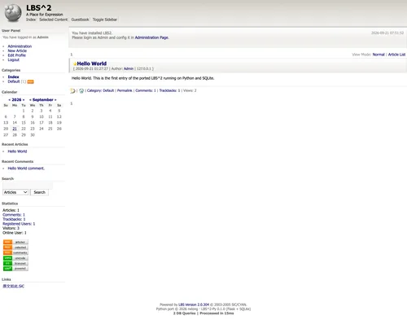
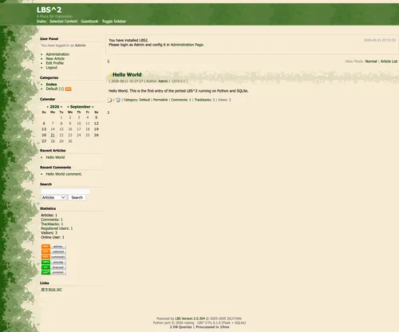
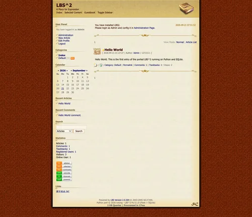

# LBS^2 (Python port)

A self-hosted weblog: a Python port of LBS^2, the weblog engine that shipped in
2005 as ASP + JScript + Access. The backend is Flask + SQLite, the frontend is
the original HTML/CSS/JS with its three themes kept intact, and the URLs keep
the classic ASP look.

- Articles with categories, drafts, hidden and private visibility, comments,
  trackbacks and RSS feeds
- Guestbook, file uploads, built-in search and a sidebar calendar
- Users, five user groups and a five level permission matrix
- Admin backend for settings, categories, groups, smilies, word filters,
  database backup/restore and attachment management
- One SQLite file and one systemd unit; no build toolchain on the server
- Pages are `default.asp`, `article.asp?id=1`, `admin.asp`; the API is served
  as `/api/articles.asp`, `/api/articles/1/comments.asp`, and so on

## Interface preview

The three themes that ship with the application; select one in the admin
backend. Click a screenshot to open it full size.

| Default | Evergreen | Oldschool |
|---|---|---|
| [](preview/default.webp) | [](preview/evergreen.webp) | [](preview/oldschool.webp) |

## Requirements

- Python 3.10 or newer
- `uv` for dependency management (optional; `pip install flask` is enough)

## Quick start

```bash
make dev
```

This creates `dev-data/`, fills in the default settings, an administrator
account and a hello world article, then serves the site on
<http://127.0.0.1:5059>.

Log in as **`Admin` / `comeon`** and change the password on the profile page -
the account is created with that documented default so a fresh install is
reachable.

## Configuration

| Setting | Where |
|---|---|
| Data directory (database, `secret_key`, uploads, backups) | `--data <dir>` on the command line; `make dev` uses `dev-data/` |
| Port and bind address | `PORT` and `HOST` environment variables (default `5059`, `127.0.0.1`) |
| `Secure` flag on the session cookie | `SESSION_COOKIE_SECURE` (default on; set `0` when serving plain HTTP locally) |
| Site title, description, theme, layout, feature switches, page sizes | The admin backend (`/admin.asp`), stored in the `blog_Settings` table |

## Deployment

```bash
make build             # copy frontend/ into server/src/static/
make install           # install to /data/release/lbs, create the database on first run
make service-install   # install and start the systemd unit
```

`make install` writes the database, settings and administrator account into
`/data/release/lbs/data` the first time and leaves an existing database alone.
Afterwards:

- `make update` - deploy a new revision without touching the data
- `make service-status` / `make service-logs` - check on the service
- `server/src/deploy/nginx/lbs.conf.example` - reverse proxy example
- `RELEASE_DIR` and `PORT` can be overridden, e.g. `make install RELEASE_DIR=/srv/lbs`

Everything the site needs at runtime lives in the data directory, so deleting
that directory resets the installation to a fresh one.

## Operations

```bash
make db-check                                    # compare a database with the code
make db-check DATA_DIR=/data/release/lbs/data    # ... against a live install
make db-init DATA_DIR=/data/release/lbs/data     # create a database by hand
```

Backups, compactions and restores are available in the admin backend under
**Database**; they write `.bak` files next to the database. The backend asks for
the administrator password a second time before it lets you in.

## Development

```bash
make test_api_full   # 10 scenarios, 277 assertions against a throw away database
make docs            # regenerate docs/database.md, docs/api.md, docs/openapi.json
```

- `frontend/` - page skeletons, themes and the JavaScript application layer
- `server/src/` - Flask application, data layer, admin backend and tooling
- `server/src/static/` - built frontend output, committed on purpose
- `docs/` - data dictionary, API reference and OpenAPI description

## Licence and credits

This project is distributed under **the same licence as LBS^2**, reproduced in
[LICENSE](LICENSE): free to use and redistribute, with or without modification,
for non-commercial purposes, provided the copyright notices are retained.
[NOTICE](NOTICE) records which files come from the original software and which
are new here.

The original ASP source is archived at
<https://github.com/sunxlonglongago/lbs2>.
